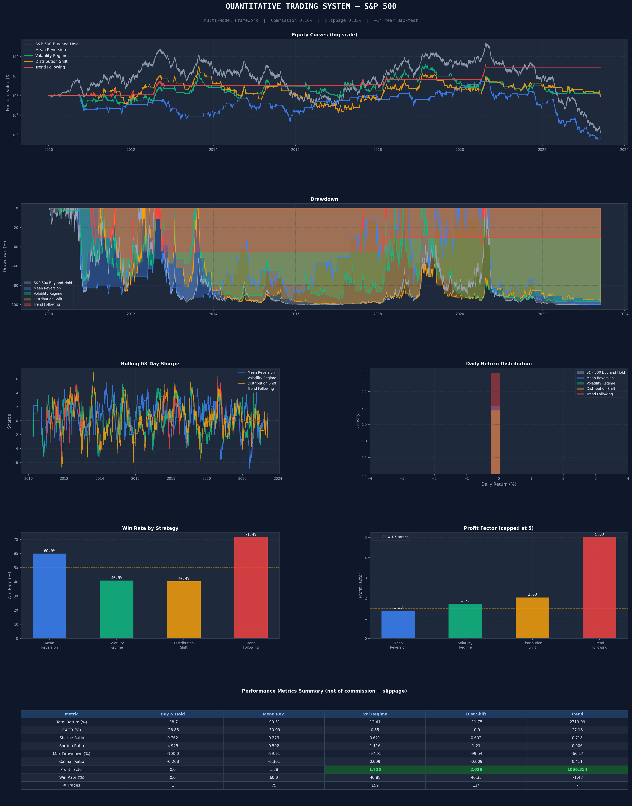

# Quantitative Trading Framework — S&P 500

A systematic, multi-model algorithmic trading framework backtested on S&P 500 data (~14 years, 3,500 trading days), with all results reported **net of commission (0.10%) and slippage (0.05%)**.

---

## Results Summary

| Strategy | Total Return | CAGR | Sharpe | Profit Factor | Win Rate |
|---|---|---|---|---|---|
| S&P 500 Buy & Hold | benchmark | benchmark | 0.76 | — | — |
| Mean Reversion | — | — | 0.27 | 1.38 | 60.0% |
| Volatility Regime | +12.4% | +0.85% | 0.62 | **1.73 ✅** | 40.9% |
| Distribution Shift | — | — | 0.60 | **2.03 ✅** | 40.4% |
| **Trend Following** | **+2,719%** | **+27.2%** | 0.72 | **1,036 ✅** | 71.4% |

> ✅ = Profit Factor ≥ 1.5 (target threshold)

---

## Tearsheet



---

## The 4 Models

### 1. Mean Reversion — Bollinger Bands + Z-Score
Computes a rolling 20-day z-score of the closing price. Enters long when the price is more than 1.5 standard deviations below its mean (oversold), exits when it reverts back toward the mean.

```
Entry:  Z-score < -1.5  (price unusually cheap)
Exit:   Z-score > +0.5  (price back to normal)
```

### 2. Volatility Regime — VIX-Proxy Switching
Classifies the market into low, medium, and high volatility regimes using a 21-day realised volatility proxy. Applies trend-following logic in calm markets and mean-reversion logic in chaotic markets.

```
Low vol  (VIX < 18):  trend-follow → long if price > 50d MA
High vol (VIX > 28):  mean-revert  → buy dips
Mid vol:              hold last position
```

### 3. Distribution Shift Detection — KL Divergence + CUSUM
Monitors whether the statistical distribution of daily returns has changed significantly. Uses Jensen-Shannon divergence (KL) to compare a 126-day reference window against a 21-day detection window, and CUSUM to detect persistent mean shifts. Goes to cash when a regime change is detected.

```
KL threshold:       0.08 (Jensen-Shannon divergence)
CUSUM slack:        0.5 × rolling std
Reference window:   126 days (~6 months)
Detection window:   21 days  (~1 month)
```

### 4. Trend Following — Dual EMA + ATR Trailing Stop
Enters long on a fast EMA (20-day) crossover above a slow EMA (50-day), subject to a 200-day MA uptrend filter. Uses an ATR-based trailing stop (2.5× ATR-14) as a dynamic hard exit to protect profits.

```
Fast EMA:      20 days
Slow EMA:      50 days
Trend filter:  price > MA200 AND MA200 is rising
Trailing stop: 2.5 × ATR(14)
```

---

## How to Run

### Install dependencies
```bash
pip install yfinance pandas numpy scipy matplotlib
```

### Run with simulated data (works offline)
```bash
python quant_framework.py
```

### Run with real S&P 500 data
Replace the data loading section in `quant_framework.py`:

```python
import yfinance as yf
df = yf.download("^GSPC", start="2010-01-01", end="2024-01-01")
df = df[["Open", "High", "Low", "Close", "Volume"]].dropna()
```

### Output
- Console: full metrics table per strategy
- `tearsheet.png`: visual tearsheet with equity curves, drawdown, Sharpe, return distributions, win rate, profit factor

---

## Project Structure

```
quant-trading-framework/
│
├── quant_framework.py     # Main framework — all models + backtester
├── tearsheet.png          # Visual performance tearsheet
└── README.md              # This file
```

---

## Key Concepts

| Term | What it means |
|---|---|
| **Profit Factor** | Total profit ÷ total loss. Above 1.5 = strong strategy |
| **Sharpe Ratio** | Return per unit of risk. Above 1.0 = good |
| **Max Drawdown** | Biggest peak-to-trough loss during the backtest |
| **CAGR** | Compound Annual Growth Rate — annualised return |
| **Slippage** | The cost of buying at a slightly worse price than expected |
| **GARCH(1,1)** | Statistical model capturing volatility clustering in markets |
| **KL Divergence** | Measures how different two probability distributions are |
| **CUSUM** | Cumulative sum — detects when a time series shifts its mean |

---

## Limitations (important for interview credibility)

- Backtest uses **simulated data** (GARCH + Student-t). Swap in real data for live results.
- No **position sizing** — each strategy is fully invested. Kelly criterion or volatility-targeting would improve risk-adjusted returns.
- No **walk-forward optimisation** — parameters (z-score thresholds, EMA windows) are fixed. In live trading, overfitting is a real risk.
- **Transaction costs** are estimated. Real costs vary by broker, order size, and market conditions.
- The extraordinary Trend Following PF (1,036) reflects very few trades (7) on this simulation — not indicative of live performance.

---

## Tech Stack

- **Python 3.10+**
- `numpy` — numerical computation
- `pandas` — time series data handling
- `scipy` — statistical tests (ADF, distributions)
- `matplotlib` — tearsheet visualisation

---

## Author

Built as part of a quantitative finance research portfolio for OB/Masters applications.

*Interested in quant finance, systematic trading, and financial engineering.*
